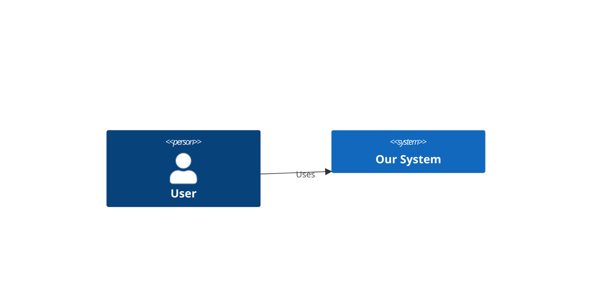

# ADR NNNN — <short title>

- **Status:** Proposed | Accepted | Superseded by ADR-XXXX
- **Date:** YYYY-MM-DD
- **Feature / area:**
- **Deciders:** <user> + agent

## Context
What problem/feature triggered this. Functional scope, and the non-functional drivers
(performance/scale, security, availability, consistency, cost) that constrain the design.

## Decision
The approach we are taking, stated plainly. What changes, what boundaries it touches,
data/contracts introduced or modified.

## Diagrams
Embed the relevant Mermaid diagrams (Context / Container / Component / Sequence / ER / State).

## Consequences
- Positive:
- Negative / trade-offs accepted:
- Follow-ups / risks to watch:

## Alternatives considered
| Option | Pros | Cons | Why not chosen |
|--------|------|------|----------------|
| A |  |  | (chosen) |
| B |  |  |  |

## Links
- Feature doc: `path/FEATURE.md`
- Related ADRs / wiki pages: [[...]]
