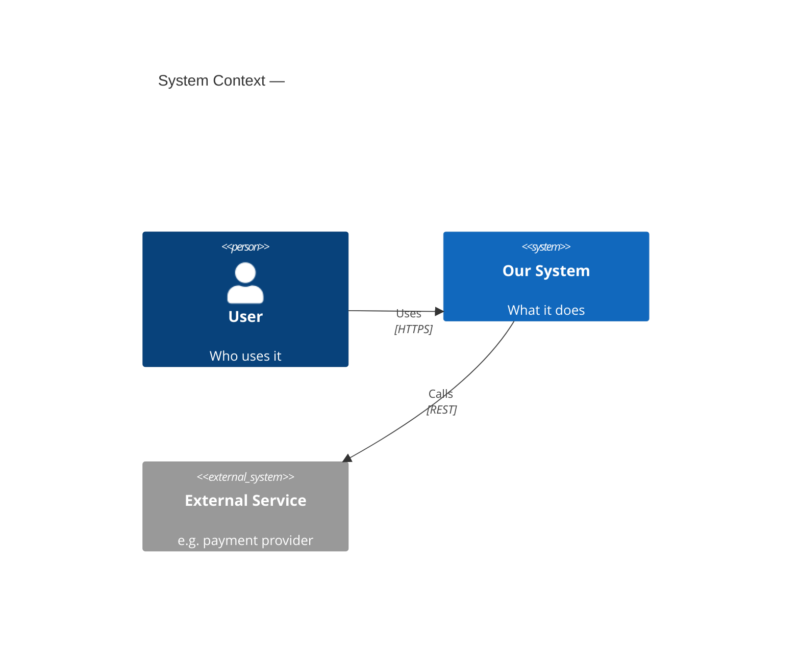
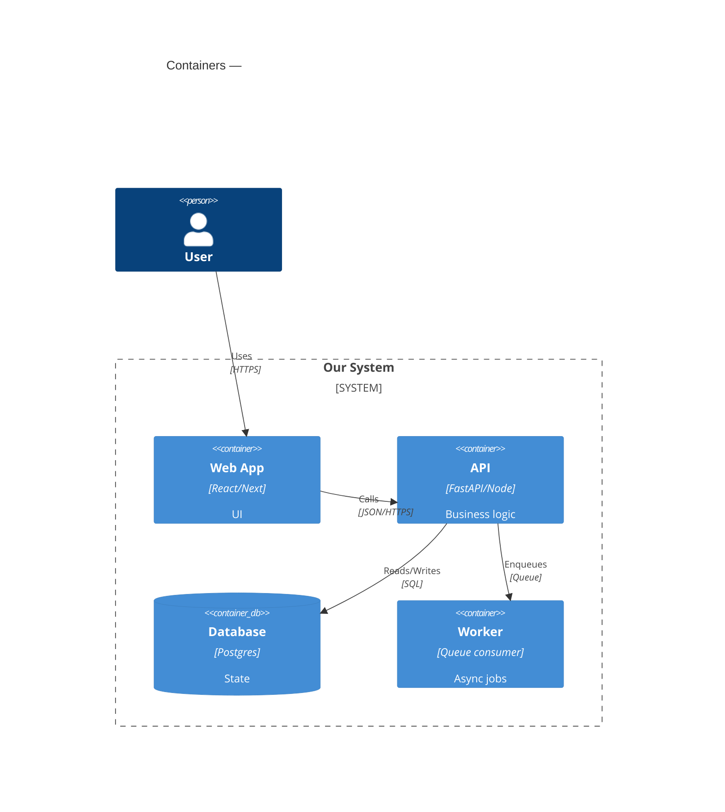
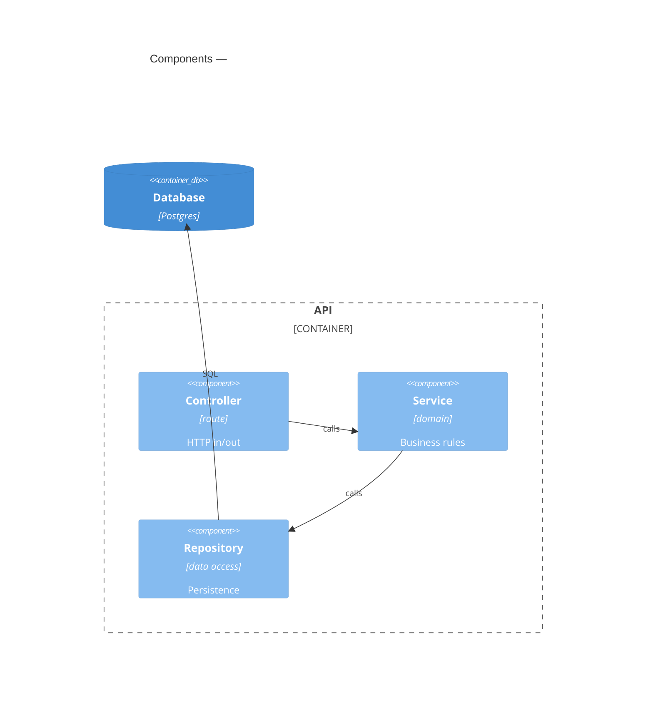
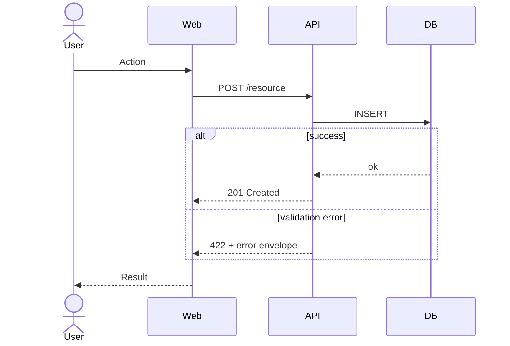
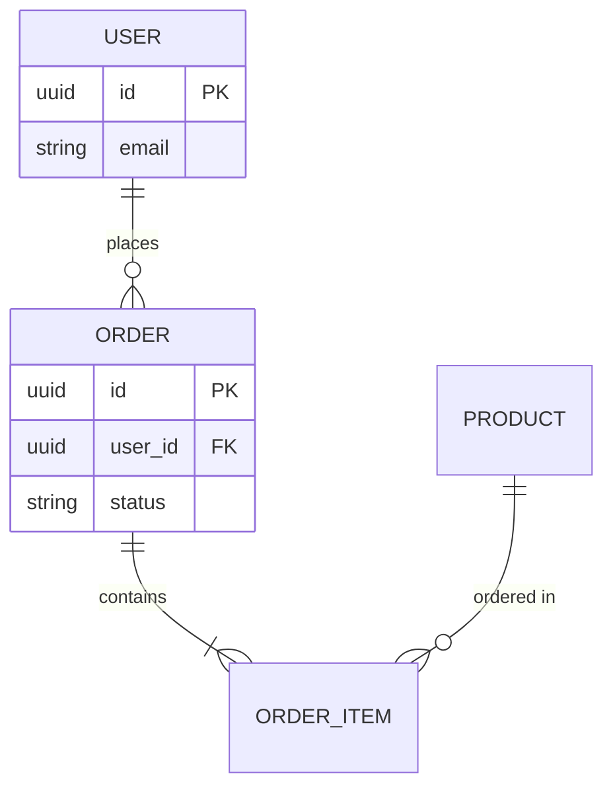
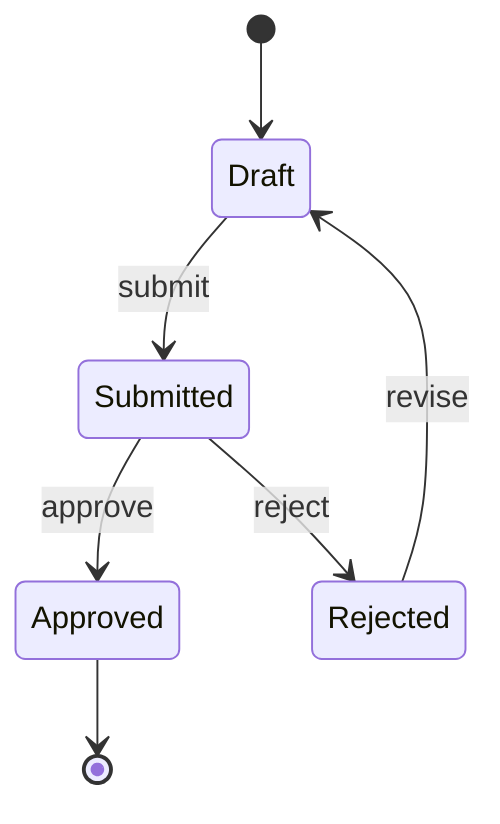
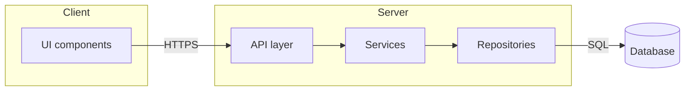

# Mermaid diagram cookbook (architecture)

Copy/adapt these. All render in GitHub, most markdown viewers, and Claude — no install.
Pick the diagrams that fit the change; you don't need all of them.

## C4 — System Context (level 1: system + actors + externals)

## C4 — Container (level 2: apps / services / datastores)

## C4 — Component (level 3: inside the changed container)

## Sequence — key flow (include the failure path)

## ER / data model (when persistence changes)

## State machine (status / workflow)

## Flowchart — module boundaries / data flow (when C4 is overkill)

Conventions: name nodes by responsibility, show the failure path in sequences, mark what is NEW vs UNCHANGED in the text around the diagram, and keep one source of truth in the ADR.
