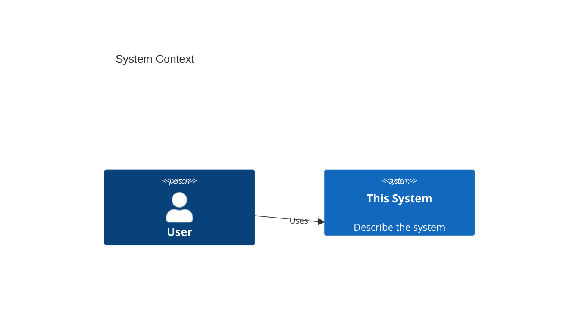

# Architecture Overview

The living architecture of this project. Updated by the `feature-architecture` skill /
`architect` subagent whenever a feature changes structure, boundaries, data, or contracts.

## System context

> Replace with the real context diagram on first architecture pass.

## Containers
_Add the C4 Container diagram (apps/services/datastores) here._

## Key decisions (ADRs)
Architecture decisions live in `../decisions/`. Newest first:

- _none yet — the first `feature-architecture` run will add ADR-0001._

## Boundaries & conventions
- Module/boundary rules: see `frontend-agent` and `backend-engineering` references.
- Each significant feature links its diagrams + ADR from its nearest `FEATURE.md`.
